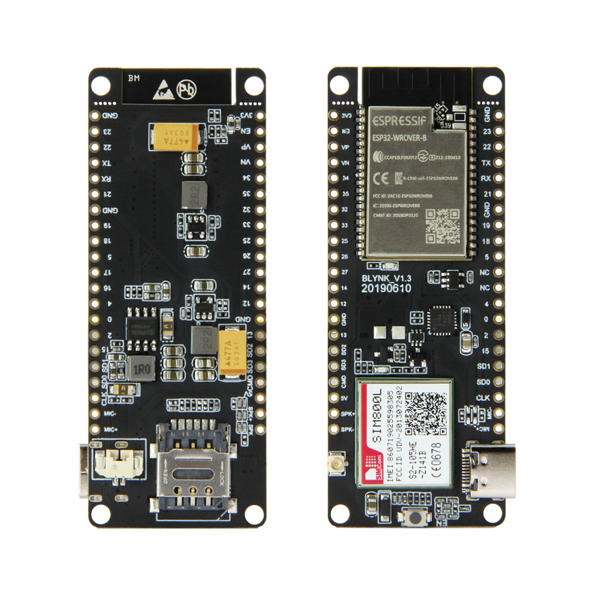

# esp32-ttgo-gsm-google

This project is an example of how to create and add data on a [Google Spreadsheet][1] using esp32 based on the [esp32-google-sheet][2].

The program read the analog 0 add value on a buffer and sends every 30 seconds to the [Google Spreadsheet][1] using the gsm.

## TTGO T-Call SIM800

This code uses the [TTGO-T-Call][3] board. Select `ESP32 Dev Module` on `Arduino IDE`.

## Install the following dependency library files:
- [TinyGSM](https://github.com/vshymanskyy/TinyGSM)

## Wifi

* ssid - wifi ssid
* password - wifi password

## PINOS

* ANALOG_PIN - analog input
* ANALOG_TIME - read analog sample

## Google

* GOOGLE_URL - google url script
* GOOGLE_TIME - send to google sample

# Distance

Send distance insted of the analogRead, using this formula:
`float distanceCM = analogRead(ANALOG_PIN) / 5.0;`

# Google Spreadsheet

For more information how to setup check the project [esp32-google-sheet][2].

----

 

 This work is licensed under a <a rel="license" href="https://creativecommons.org/licenses/by-sa/4.0/">Creative Commons Attribution-ShareAlike 4.0 International License</a>.

[1]: https://docs.google.com/spreadsheets/
[2]: https://github.com/ricaun/esp32-google-sheet
[3]: https://github.com/Xinyuan-LilyGO/TTGO-T-Call